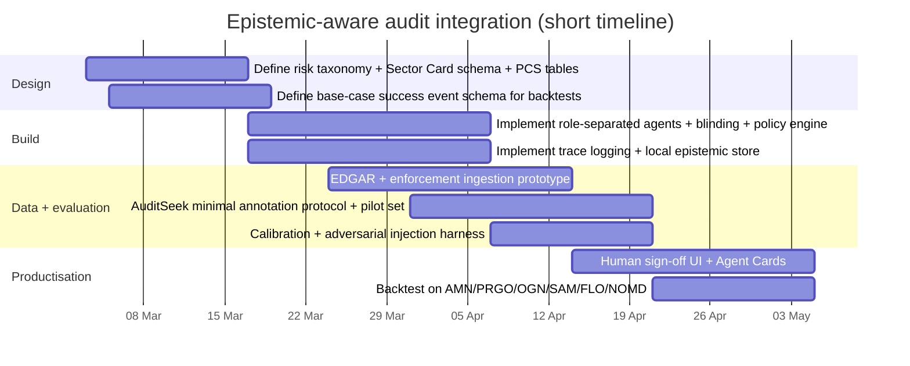

# Executive summary

An LLM-based multi-agent investment audit system typically fails at the same place human analysts most often fail: **it outputs crisp probabilities from epistemically weak foundations** (underspecified theses, thin evidence, non-modelable regime or regulatory risk). Recent work suggests this is not primarily a prompting defect; it is a **system design and evaluation** defect where incentives favour “answering” over “abstaining”, and where multi-agent aggregation can amplify confident but unreliable peers. citeturn7search3turn4view0turn10view0

This report integrates four primary sources—ECL, arXiv:2505.22655v1, SeekBench, and Empirica—into an actionable architecture for investing audits:

- Use **Epistemic Context Learning (ECL)** to weight agent outputs by **historical reliability**, not rhetorical quality, by explicitly separating (a) trust estimation from (b) reasoning/aggregation. citeturn4view0turn15view0  
- Use arXiv:2505.22655v1 to treat “epistemic uncertainty” for tool-using agents as a triad of **underspecification uncertainty**, **interactive learning** (ask high-value follow-ups), and **rich output uncertainty** (communicate competing possibilities and what reduces uncertainty). citeturn12view0turn12view2turn1view1  
- Use SeekBench as a blueprint for **trace-level evaluation** (groundedness, recovery, calibration as “answer only when evidence is sufficient”), and adapt it into a finance-specific **AuditSeek** benchmark for your pipeline. citeturn1view2turn5view0turn11view5  
- Use Empirica as an engineering pattern for **persisted epistemic state**, **gated action** (readiness checks), and **local audit trails** (SQLite + git notes) to support continuity across scans and enforce “human-in-the-loop” sign-off. citeturn1view3turn6view1turn6view3  

The key practical mechanism proposed is a two-part “survival layer”:

1) **Probability Confidence Score (PCS)**: a mechanical, evidence-anchored score that measures *the epistemic quality of the probability*, not introspective “confidence”.  
2) **Survival-Weighted Probability**: replace \(P_\text{base}\) with \(P_\text{eff}=P_\text{base}\times m(\text{PCS})\), and additionally enforce **PCS-based position caps** (and a binary-outcome override) even when the score is high. This aligns with abstention/HITL research and with conformal methods’ emphasis on coverage/uncertainty sets, not false precision. citeturn10view0turn11view1turn7search2turn7search3  

Sector context is treated as a first-class artefact: build reusable **Sector Cards** (e.g., US Banking), ingest regulator and standardised reporting primitives (Fed stress tests; FDIC/FFIEC call reports; SEC SIC/EDGAR), and feed sector priors into risk typing and PCS thresholds. citeturn13search2turn13search3turn9search0turn13search0  

## Resources

https://openreview.net/forum?id=r0L9GwlnzP ( Do LLM Agents Know How to Ground, Recover, and Assess? Evaluating Epistemic Competence in Information-Seeking Agents )
https://github.com/SHAO-Jiaqi757/SeekBench (SeekBench: A Benchmark for Evaluating Epistemic Competence in Information-Seeking Agents)
https://github.com/Nubaeon/empirica ( Cognitive Operating System for AI Agents - Git-native epistemic middleware enabling self-awareness, multi-agent coordination, and measurable learning through CASCADE workflow. Turns context loss into transparent uncertainty tracking. )

## Primary sources synthesis

The following table concisely summarises the two papers and two repositories as design primitives for epistemic-aware investment audits.

| Primary source | Key claims | Methods and results | Limitations and “investment audit translation” |
|---|---|---|---|
| “Epistemic Context Learning: Building Trust the Right Way in LLM-Based Multi-Agent Systems” (ECL) | Multi-agent systems “blindly conform” to misleading peers due to sycophancy and poor peer-reliability evaluation; a more tractable problem is **estimating who is reliable** from history, not re-deriving correctness each round. citeturn4view0turn15view0 | Formalises “history-aware reference” and implements a **two-stage pipeline** that decouples trust estimation from final reasoning, creating a bottleneck that forces trust reasoning from history; further optimises with RL + auxiliary rewards; reports strong gains including small models outperforming much larger history-agnostic baselines and near-perfect performance for frontier models in tested settings. citeturn4view0turn2view1turn15view0 | Requires an **interaction history store** and reliable labels for “peer reliability”; in investing, you must manufacture history via backtests, calibration tasks, and ongoing ground-truth tracking of prior audit calls; also requires defending against regime changes where past reliability may not transfer. citeturn4view0turn15view0 |
| arXiv:2505.22655v1 “Uncertainty Quantification Needs Reassessment for Large-language Model Agents” | Aleatoric/epistemic dichotomy is often contradictory and loses meaning for interactive agents; proposes focusing on **underspecification uncertainties**, **interactive learning** (follow-up questions), and **output uncertainties** (communicating uncertainty with richer strings than a scalar). citeturn12view0turn12view1 | Provides definitional critique and evidence that ambiguity/underspecification is frequent; motivates using follow-up questions chosen for information gain, and presenting competing possibilities/what reduces uncertainty rather than forcing a single probability. citeturn12view2turn12view3turn1view1 | Agenda-setting (not an end-to-end validated system). For investing, you operationalise these ideas as PCS checklists, explicit escalation prompts, and “abstain/watchlist” gates when uncertainty is irreducible within the decision horizon. citeturn12view0turn10view0 |
| SeekBench repository + paper (“Do LLM Agents Know How to Ground, Recover, and Assess?”) | “Answer-only” metrics ignore core epistemic skills; measure **groundedness**, **recovery** (search reformulation), and **calibration** (answering only when evidence is sufficient). citeturn1view2turn11view5 | Supplies an expert-annotated dataset and an LLM-as-judge pipeline; provides scripts for generating, parsing, annotating, and analysing traces and for computing metrics. Repo includes a bundled dataset and analysis scripts (grounded_reason, recovery, calibration). citeturn1view2turn5view0 | It is open-domain QA/search; finance needs an **AuditSeek adaptation**: EDGAR/filings evidence primitives, enforcement actions, and finance-specific “evidence sufficiency” definitions tied to base-case success criteria. citeturn1view2turn13search0turn13search5 |
| Empirica repository | Engineering-first “epistemic middleware”: agents track explicit epistemic state and prevent action until readiness gates pass; persist learning across sessions; maintain local, auditable state. citeturn1view3turn6view1 | Implements CASCADE loop (PREFLIGHT → CHECK → POSTFLIGHT) with illustrative readiness thresholds (e.g., know ≥ 0.70, uncertainty ≤ 0.35) and live metacognitive signals; persists data locally (SQLite, git notes) and claims no telemetry. citeturn1view3turn6view1turn6view3 | Not peer-reviewed research; thresholds are heuristics. In investing audits, treat Empirica as a **governance and traceability pattern**: local provenance, gating for human sign-off, and persistent sector/ticker memory—then validate thresholds by calibration/backtesting. citeturn6view1turn10view0turn7search0 |

## Literature survey

This focused survey (2019–2026, with a few foundational precursors where unavoidable) identifies system-building blocks for epistemic uncertainty, calibration, abstention/conformal prediction, and HITL governance for LLM agents.

**Confidence calibration and elicitation**  
Calibration research highlights that modern neural nets are often miscalibrated, and formalises metrics such as Expected Calibration Error (ECE) and the use of reliability diagrams; these ideas are directly applicable to “probability of thesis success” once you define success events and collect outcomes. citeturn7search0turn7search4  
LLM-specific work shows that models can sometimes estimate the probability their own answers are correct (“P(True)”) and can be calibrated when elicited in the right format, but generalisation and calibration can degrade on new tasks—supporting the need for system-level PCS gates rather than trusting self-reported confidence. citeturn14search8turn14search0  
Long-form calibration work argues binary correctness is insufficient for long-form outputs and proposes distributional calibration frameworks and confidence elicitation strategies (self-consistency, self-evaluation), reinforcing that “confidence” in complex reports should be decomposed rather than collapsed into a single scalar. citeturn14search2turn14search6  
Instruction-tuning work for uncertainty shows that calibration can be actively taught (not just prompted), suggesting a route for training your audit agents to produce PCS-relevant intermediate artefacts and to reduce “threshold-hugging” probabilities. citeturn14search16  

**Uncertainty signals and hallucination detection**  
Semantic-uncertainty work argues uncertainty must respect semantic equivalence (different strings can express the same meaning) and introduces semantic entropy/semantic uncertainty as a more faithful uncertainty measure than token-level entropy for language outputs. citeturn8search1turn10view1  
A closely related line demonstrates that entropy-based uncertainty estimators (including semantic entropy) can detect a subset of hallucinations (“confabulations”), and can be used even with limited access to model internals—useful if your pipeline uses API models. citeturn14search3turn8search9  
SelfCheckGPT provides a black-box, sampling-based consistency check: if samples diverge materially, hallucination likelihood increases; in investing, this motivates a “variance alarm” when multiple samples disagree on key factual claims or risk classification. citeturn14search5turn10view2  

**Abstention as a capability (not a failure)**  
A dedicated survey frames abstention from three perspectives—query answerability, model confidence, and human values—and treats abstention as a spectrum (including partial abstention). This is directly translatable to “watchlist only” outputs when PCS is low or binary risk dominates. citeturn10view0turn11view2  
OpenAI’s analysis argues hallucinations persist because training and evaluation often reward guessing over admitting uncertainty; therefore “penalise guessing / reward abstention” must be designed into scoring and workflow gates—exactly what PCS multipliers and caps implement for investment audits. citeturn7search3turn7search15  

**Conformal prediction and uncertainty sets**  
Conformal Language Modelling adapts conformal ideas to free-text generation by constructing prediction sets with coverage guarantees and using a calibrated stopping rule to sample diverse outputs until the set is likely to contain at least one acceptable response. This supports a design pattern: when uncertainty is high, return a structured *set of plausible competing states* and escalate to a human rather than forcing a single forecast. citeturn11view0turn11view1turn7search2  

**Multi-agent reliability, social dynamics, and trust**  
Sycophancy research shows assistants can shift towards user-belief alignment over truthfulness, which in multi-agent settings becomes herd behaviour and “confident peer wins”. This motivates ECL-style trust-from-history and explicitly adversarial peer-injection tests. citeturn8search4turn4view0  

**HITL governance, documentation, and auditability**  
The NIST AI RMF formalises organisational “GOVERN” practices like documenting roles/responsibilities, monitoring, and periodic review; this supports your requirement for explicit human sign-off gates and traceable audit trails for decisions. citeturn11view3turn8search2  
Model Cards propose standardised documentation of intended use and performance; an “Agent Card” adapts this directly to audit agents (inputs/outputs, known failure modes, calibration metrics, escalation triggers). citeturn8search3turn8search7  
Human-AI interaction guidelines emphasise designing for uncertainty and error handling (user control, expectation setting), aligning with UI patterns for PCS escalation and sign-off. citeturn15view0turn11view3  

## System architecture with PCS, survival weighting, and sector priors

This section proposes a reference architecture that fuses ECL (trust from history), arXiv:2505.22655v1 (underspecification + interactive learning), SeekBench (trace-level epistemic evaluation), and Empirica (persisted epistemic state and gating).

### Core objects

**Sector Card (reusable template)**  
A versioned artefact representing sector-specific epistemic priors: typical KPIs, typical binary risks, regulatory bodies, evidence sources, and “what would invalidate assumptions”. Sector Cards are reused across tickers and updated (e.g., quarterly). Sector Cards can be keyed by SIC (SEC) or by an investment taxonomy like GICS; the SEC explicitly uses SIC codes in EDGAR filings as a business-type indicator. citeturn9search0turn9search1turn9search13  

**Audit Trace (SeekBench-inspired)**  
A structured trace for each audit: evidence retrieval actions, intermediate claims, evidence-state tags, and decisions. SeekBench’s toolkit demonstrates how to parse traces, annotate them, and compute groundedness/recovery/calibration metrics. citeturn5view0turn1view2  

**Epistemic State Store (Empirica-inspired)**  
Persisted local state across sessions: knowns, unknowns, readiness gates, and checkpoints; Empirica illustrates storing state locally (SQLite) and optionally in git notes for audit checkpoints. citeturn6view1turn1view3turn6view0  

### Agent roles and blinding (anti-self-referential design)

A minimal robust audit pipeline:

- Sector Primer Agent (creates/loads Sector Card; no probabilities)  
- Evidence Dossier Agent (collects and normalises evidence; no probabilities)  
- Risk Type Classifier (sector-aware classification + binary flag; no probabilities)  
- Probability Forecaster (produces \(P_\text{base}\); **blinded from PCS**)  
- PCS Auditor (produces PCS, multiplier, caps; **blinded from \(P_\text{base}\)**)  
- Sizer/Aggregator (computes \(P_\text{eff}\), applies caps, escalates; uses ECL trust weights)  
- Red Team / Thesis-Break Agent (proposes failure modes; cannot set probability or size)

The blinding mirrors ECL’s design goal: prevent shortcutting from the “current round” content and force reliance on structured signals (history, evidence, checklists). citeturn4view0turn1view2  

### PCS and survival-weighted probability tables

**PCS mapping (mechanical checklist)**  
Compute PCS from a fixed checklist where each answer must cite evidence pointers or declare “NO EVIDENCE”, reflecting the “evidence sufficiency” calibration notion in SeekBench and the underspecification framing in arXiv:2505.22655v1. citeturn11view5turn12view2turn12view3  

| No-count on checklist | PCS | Interpretation |
|---:|---:|---|
| 0 | 5 | high epistemic quality |
| 1 | 4 | small gaps |
| 2 | 3 | material blind spots |
| 3 | 2 | major blind spots |
| 4–5 | 1 | non-modelable without escalation |

**Survival-weighted probability multiplier**

| PCS | Multiplier \(m(\text{PCS})\) | Intended effect |
|---:|---:|---|
| 5 | 1.00 | no penalty |
| 4 | 0.95 | modest penalty |
| 3 | 0.85 | meaningful penalty (often flips “pass” to “watchlist”) |
| 2 | 0.70 | severe penalty |
| 1 | 0.50 | force abstention / watchlist default |

Then \(P_\text{eff}=P_\text{base}\times m(\text{PCS})\).

This implements the “reward abstention, penalise guessing” idea that OpenAI argues is required for trustworthy systems. citeturn7search3turn7search11  

**PCS-based position caps (independent of score)**  
Even if your valuation score is high, epistemic fragility caps exposure (survival-first geometry), echoing the abstention literature’s framing of refusal/caution as a legitimate capability. citeturn10view0turn11view2  

| PCS | Max position size | Human escalation rule |
|---:|---:|---|
| 5 | no additional cap | optional sign-off |
| 4 | 12% | sign-off if binary flag true |
| 3 | 8% | sign-off required + “risk memo” |
| 2 | 5% | sign-off required + explicit evidence plan |
| 1 | 0% | watchlist only |

**Sector-aware risk type penalties (optional add-on)**  
Risk type classification is a separate variable from PCS; it can increase PCS friction and tighten caps in sectors where tail risks are inherently legal/regulatory/binary (e.g., bank capital rules, drug approvals). This aligns with arXiv:2505.22655v1’s warning that traditional epistemic/aleatoric splits do not capture the interactive, underspecified nature of decision contexts. citeturn12view0turn12view1  

A practical mapping:

| Risk type | Typical “epistemic hazard” | Default PCS friction (suggested) |
|---|---|---|
| Operational/Financial | modelable with filings and KPIs | none |
| Cyclical/Macro | regime dependency; scenario uncertainty | −1 PCS unless strong precedent |
| Regulatory/Political | discretionary outcomes; non-stationarity | −1 to −2 PCS unless clear precedent |
| Legal/Investigation | binary, path dependent | −2 PCS, likely triggers binary override |
| Structural fragility | single point of failure | −1 PCS and enable binary flag |

### Binary-outcome override

Set `binary_outcome_flag = true` if the dominant risk is event-driven (regulatory ban, injunction, enforcement action, single-supplier failure, refinancing cliff). When triggered:

- if PCS ≤ 3 → max 5% and mandatory sign-off  
- if PCS ≤ 2 → watchlist only

This is designed to reduce the failure mode SeekBench calls “overconfident answering” (acting before sufficient evidence) and to follow the abstention literature’s recommendation to refuse or caution when uncertainty is high. citeturn11view5turn10view0turn11view2  

### How to ingest sector-level signals and reuse them across tickers

Sector priors should be (a) official, (b) standardised, and (c) reusable across firms.

**Step one: sector assignment and mapping**  
Use at least one stable mapping, such as:

- SEC SIC codes (available in disseminated EDGAR filings) to anchor compliance/reporting expectations. citeturn9search0turn13search0  
- GICS (sector → industry group → industry → sub-industry) to align with investment research conventions and cross-company comparability. citeturn9search1turn9search9turn9search13  

**Step two: sector “official evidence sources”**  
For **US Banking → JPM** (example ticker used as a representative large bank), build the Sector Card around regulator and standardised reporting primitives:

- Federal Reserve stress tests and the stress capital buffer mechanism (SCB) as a sector-level constraint and tail-risk driver. citeturn13search2turn13search6  
- FDIC “Call Report” forms/instructions and FFIEC reporting forms as standardised balance-sheet/income primitives you can parse across banks. citeturn13search3turn13search15  

For cross-sector legal/investigation priors, ingest enforcement primitives:

- SEC enforcement landing pages (litigation releases, administrative proceedings, trading suspensions) as structured event-risk signals used by the risk classifier to set binary flags and reduce PCS. citeturn13search5turn13search1  

**Step three: how sector priors feed PCS and risk typing**  
Sector priors should not “decide the outcome”; they should:

- constrain what counts as sufficient evidence (e.g., banks require capital/asset-quality evidence; healthcare requires reimbursement/regulatory evidence),  
- identify sector-specific binary triggers, and  
- set default friction (e.g., bank regulatory shifts elevate Regulatory/Political risk type and lower PCS unless evidence is strong).

This is consistent with arXiv:2505.22655v1’s thesis that uncertainty in interactive agent settings is shaped by underspecification and context, and requires follow-ups rather than forced probability numbers. citeturn12view2turn12view3  

### Mermaid workflow

```mermaid
flowchart TD
  A[Ticker + Sector + Audit Config] --> B[Sector Primer Agent: Sector Card]
  B --> C[Evidence Dossier Agent: EDGAR + transcripts + regulator sources]
  C --> D[Risk Type Classifier: sector-aware + binary flag]
  C --> E[Probability Forecaster: P_base (blinded from PCS)]
  D --> F[PCS Auditor: PCS + multiplier + cap (blinded from P_base)]
  E --> G[Compute P_eff = P_base * m(PCS)]
  F --> G
  G --> H[Sizer/Aggregator: apply caps + overrides + policy]
  H --> I{Escalation? PCS<=2 or BinaryFlag or Contradictions}
  I -- Yes --> J[Human Sign-off UI + Memo]
  I -- No --> K[Auto: Watchlist/Invest recommendation]
  J --> L[Audit Trail + Provenance Log]
  K --> L
  L --> M[Trust History Store (ECL-style)]
  M --> H
```

## Prompts and workflows designed to minimise self-referential confidence bias

The core anti-bias design is: **agents do not score their own reliability**. Instead, they produce structured artefacts that other agents score mechanically (PCS), and long-run trust is learned from measured outcomes (ECL-style). citeturn4view0turn11view5turn12view0  

### Checklist questions (PCS)

A finance-ready PCS checklist (each answer requires evidence pointers):

1) Modelability: dominated by measurable operational/financial drivers? citeturn12view0turn12view1  
2) Regulatory discretion minimal? (i.e., not decided by a discretionary rule change) citeturn13search5turn13search2  
3) Precedent coverage: strong reference class exists? (at least 2 comparable historical cases) citeturn12view2turn14search8  
4) Non-binary: outcome not determined by a single event? citeturn10view0turn11view5  
5) Evidence sufficiency: dossier provides enough primary evidence to answer without guessing? citeturn1view2turn11view5  

### Concrete agent prompt templates

The following templates are intentionally “role-locked”. They are written for a typical orchestration layer and can be adapted to your Obsidian workflow.

```text
SYSTEM (Sector Primer Agent):
Create/refresh a Sector Card for the given sector and jurisdiction. Do NOT estimate probability or recommend investing.

OUTPUT JSON:
- sector_taxonomy: {sic, gics if available}
- official_sources: [regulators, standard reporting forms, primary datasets]
- sector_kpis: 10–15
- typical_tail_risks: 8–12
- binary_event_triggers: 6–10
- sector_priors: {risk_type_default_friction, evidence_sufficiency_minimums}
```

```text
SYSTEM (Evidence Dossier Agent):
Collect and structure evidence. Do NOT provide probabilities, PCS, or sizing.

OUTPUT JSON:
- base_case_success_candidates: 2–3 measurable definitions
- key_claims: 10–15 (each must include provenance: source/date/excerpt)
- contradictions: 0–10 (pairs of conflicting claims with pointers)
- unknowns: 10–20 (underspecification gaps)
- evidence_quality: {coverage_score, primary_source_ratio}
```

```text
SYSTEM (Risk Type Classifier):
Classify dominant risk types and binary-outcome flag. Do NOT output probability or sizing.

INPUT: Sector Card + Evidence Dossier

OUTPUT JSON:
- risk_types: subset of {Operational, Cyclical, Regulatory, Legal, Structural}
- binary_outcome_flag: true/false
- pcs_checklist: {q1..q5: Yes/No + evidence pointer or NO_EVIDENCE}
- human_questions: minimum set of follow-ups that would change q answers
```

```text
SYSTEM (Probability Forecaster):
Estimate P_base only. You are blinded from PCS. If the success event is underspecified, abstain and ask clarifying questions.

OUTPUT JSON:
- success_definition: chosen measurable definition
- P_low, P_base, P_high
- rationale: {evidence_for_success, evidence_for_failure, reference_class}
- abstain: true/false
- if abstain: follow_up_questions (<=5)
```

```text
SYSTEM (PCS Auditor):
Compute PCS mechanically. You are blinded from P_base.

INPUT: checklist answers + risk types + binary flag

OUTPUT JSON:
- PCS
- multiplier_m
- position_cap
- escalation_required
- escalation_reason
```

### Decision rules (pipeline logic)

Rules that directly target observed failure modes (“threshold hugging”, premature answers, conformity):

- If **evidence_quality.coverage_score is low** or contradictions exceed a threshold, force abstention/escalation rather than allowing probability assignment (SeekBench “overconfident answering” failure mode). citeturn11view5turn11view6turn1view2  
- If an agent repeatedly outputs \(P_\text{base}\) just above the pass threshold, record a “threshold-hugging” behaviour signal and downweight via the ECL-style reliability store (trust from history). citeturn4view0turn2view1  
- Use a “variance alarm”: run multiple sampled completions for key claims; high semantic divergence triggers “uncertainty escalation” (semantic entropy / SelfCheckGPT rationale). citeturn8search1turn14search5turn10view2  

## Evaluation strategy and datasets

A credible epistemic-aware investment audit system needs evaluation at two levels:

- **Forecast calibration** (are the probabilities empirically meaningful?)  
- **Process epistemics** (did the system behave responsibly given evidence?)

### Calibration metrics

- **Brier score** for probabilistic forecasts (proper scoring rule for binary events). citeturn7search1turn7search5  
- **ECE** and reliability diagrams for miscalibration analysis (binning-based discrepancy between predicted confidence and empirical accuracy). citeturn7search0turn7search12  
- Report both **pre-PCS** (\(P_\text{base}\)) and **post-PCS** (\(P_\text{eff}\)) calibration; the goal is \(P_\text{eff}\) being better calibrated because epistemically weak cases are downweighted or escalated.

### Process-level tests (SeekBench-inspired)

SeekBench formalises groundedness, recovery, and calibration over traces, and provides code to generate/annotate/analyse traces. This supports building a finance-specific AuditSeek adaptation with similar artefacts. citeturn1view2turn5view0turn11view6  

A minimal AuditSeek label schema:

- **Groundedness**: each key claim must link to a primary source excerpt (10‑K/10‑Q/8‑K, 20‑F, credit agreement, regulator publication).  
- **Recovery**: if initial retrieval is weak, the agent must demonstrate query refinement or alternate source selection.  
- **Calibration**: if evidence state is insufficient, the correct behaviour is abstention/escalation, not guessing.

SeekBench explicitly breaks calibration error into overconfident answering vs overcautious abstention, which is directly useful for tuning PCS thresholds and caps. citeturn11view5turn1view2  

### Adversarial peer injection and sycophancy tests

- Inject a malicious/confident peer into multi-agent deliberation and evaluate whether the aggregator resists via trust-history weighting (ECL objective). citeturn4view0turn15view0  
- Run “user-belief pressure” prompts to measure sycophancy and verify that the pipeline’s mechanical PCS and evidence constraints prevent probability inflation. citeturn8search4turn8search0  

### Backtesting on your prior scans

For AMN/PRGO/OGN/SAM/FLO/NOMD, define an explicit **base-case success event** (e.g., target price within a fixed horizon, or operational milestone + no solvency failure). Details are currently unspecified; choose one definition consistently and version it.  
Then re-run the pipeline with the ancestral evidence snapshot per audit date (to avoid leakage) and measure:

- calibration of \(P_\text{base}\) and \(P_\text{eff}\) against realised outcomes,  
- “false positive” rate reduction after PCS weighting (expected),  
- capital at risk distribution under PCS caps (simulate your sizing rules).

### Suggested datasets and evidence sources

- SeekBench data + toolkit for process-level evaluation methodology and trace tooling. citeturn5view0turn1view2  
- **AuditSeek (proposed)** finance adaptation built from:  
  - EDGAR submissions + extracted XBRL via SEC APIs, citeturn13search0turn13search12  
  - SEC enforcement artefacts (administrative proceedings, litigation releases, trading suspensions), citeturn13search1turn13search5  
  - sector regulator sources (e.g., Federal Reserve stress tests; FDIC/FFIEC call report materials) for sector cards. citeturn13search2turn13search3turn13search15  

## Implementation and governance

### Logging, provenance, and audit trails

A survival-first investment audit system should treat every audit as an auditable artefact:

- Store the **evidence dossier**, **risk classification**, **PCS checklist evidence pointers**, \(P_\text{base}\), \(P_\text{eff}\), sizing caps applied, and human sign-off decisions. SeekBench demonstrates how trace logs enable diagnosis of “epistemic process” rather than only final answers. citeturn5view0turn1view2  
- Persist state across sessions: Empirica provides a concrete pattern (local SQLite + git notes checkpoints; “no telemetry” claim) which can be repurposed for investment audits to avoid re-deriving sector priors and to maintain continuity of “known unknowns” across scans. citeturn6view1turn6view0turn6view2  

### Explainability as decision support (not storytelling)

ArXiv:2505.22655v1 argues that agents can communicate uncertainty more richly than a scalar by presenting competing possibilities and what would reduce uncertainty; conformal methods offer a conceptual analogue: return sets/intervals instead of false precision. This is aligned with investor needs: “what must be true?” and “what breaks?”. citeturn1view1turn12view0turn11view1  

### UI/UX for human sign-off

A sign-off UI should show:

- The PCS checklist answers with evidence pointers and “NO EVIDENCE” markers,  
- Whether the binary override fired and why,  
- The exact multiplier/cap applied,  
- The minimal follow-up questions required to change PCS (interactive learning).

This maps to NIST AI RMF “GOVERN” expectations that roles, responsibilities, monitoring, and review processes are explicit rather than implicit. citeturn11view3turn10view4  

### Agent Cards

Adapt Model Cards into **Agent Cards**:

- role, allowed outputs, prohibited outputs (e.g., “classifier may not output probability”),  
- calibration metrics and process metrics (Brier/ECE, groundedness/recovery/calibration),  
- failure modes (sycophancy susceptibility; threshold hugging; evidence skipping),  
- escalation triggers and policy gates.

Model Cards establish the rationale for documentation in high-impact applications, which investment decision support resembles by risk profile. citeturn8search3turn8search7  

## Limitations and roadmap

### Failure modes and mitigations

| Failure mode | Why it happens | Mitigations tied to the sources |
|---|---|---|
| PCS laundering | Agents rationalise checklist “Yes” without evidence | Require evidence pointers or “NO EVIDENCE” per item; audit trace-level groundedness; adopt SeekBench-style calibration failure analysis. citeturn11view5turn1view2 |
| Sycophancy / probability inflation | Assistants align to user priors and “pass thresholds” | Role separation + blinding; adversarial peer injection; ECL trust-from-history weighting; explicit “threshold hugging” detectors. citeturn8search4turn4view0 |
| Over-penalisation (too few investable names) | Survival-first caps reduce throughput | Treat low PCS as watchlist with an explicit evidence plan (interactive learning); revisit when new filings or sector signals update. citeturn12view3turn10view0 |
| Regime shift (sector priors stale) | Sector dynamics change | Version Sector Cards; schedule periodic review; ingest regulator updates (e.g., bank stress test policy shifts) and update priors. citeturn13search2turn11view3 |
| Irreducible hallucination risk | LMs can still confabulate even with calibration | Treat provenance and abstention as permanent constraints; use semantic uncertainty and sampling-consistency alarms. citeturn14search3turn10view2turn7search3 |

### Recommended next steps and short timeline

A short, engineering-realistic path (no budget, roles only). Exact dataset sizes and labelling volumes are unspecified and should be selected based on your backtesting needs.



**Resource roles**

- Agent/workflow engineer (orchestration, schemas, blinding, policy engine)  
- Data engineer (EDGAR + enforcement ingestion; provenance store) citeturn13search0turn13search5  
- Evaluation/ML engineer (Brier/ECE, SeekBench-style trace metrics, adversarial tests) citeturn7search1turn7search0turn1view2  
- Product/UX engineer (sign-off UI and audit trail views aligned with governance) citeturn11view3  
- Domain analyst (sector cards, reference classes, base-case success definitions)

### Obsidian templates

```markdown
# turnaround-audit.md — {{TICKER}}

## Snapshot
- Sector:
- Jurisdiction:
- Classification: SIC / GICS (if available)
- Audit date:
- Data cut-off date:

## Base-case success definition
- Definition (binary, measurable):
- Time horizon:
- Key operational thresholds:
- “No-go” conditions (solvency / legal / regulatory):

## Evidence dossier (primary-source anchored)
### Key claims
- Claim:
  - Source:
  - Date:
  - Excerpt / pointer:
  - Strength: direct / indirect / weak

### Contradictions
- A vs B:
  - Pointers:

### Unknowns / underspecification
- Unknown:
- Why it matters:
- What would resolve it:

## Sector card (reusable priors)
- Sector template version:
- Sector KPIs used:
- Sector binary triggers checked:

## Risk typing (sector-aware)
- Dominant risk types:
- Binary-outcome flag: yes/no
- Tail-risk triggers hit:

## Probability + survival weighting
- P_low / P_base / P_high:
- PCS:
- Multiplier m(PCS):
- Effective probability P_eff:
- Position cap by PCS:
- Binary override applied: yes/no

## Human sign-off (if escalated)
- Decision: Invest / Watchlist / Reject
- Approved max size:
- Rationale (what evidence supports override):
- Evidence plan to reduce uncertainty:
```

```markdown
# epistemic-add-on.md — {{TICKER}}

## PCS checklist (evidence-anchored)
1) Modelable from available data? (Y/N + pointer)
2) Regulatory discretion minimal? (Y/N + pointer)
3) Strong precedents exist? (Y/N + pointer)
4) Non-binary outcome? (Y/N + pointer)
5) Evidence sufficient to answer now? (Y/N + pointer)

## Human escalation questions
- Q1:
- Q2:
- Q3:

## “Unknowable vs unknown”
- Unknowable (structural):
- Unknown (resolvable with new evidence):

## Re-run triggers
- Next filing / transcript:
- Sector/regulatory milestone:
- Catalyst confirmation signal:
```
